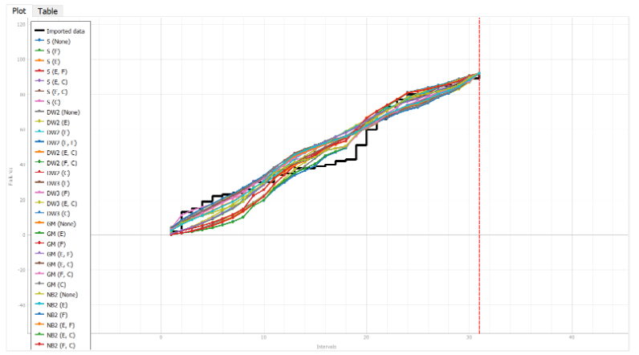
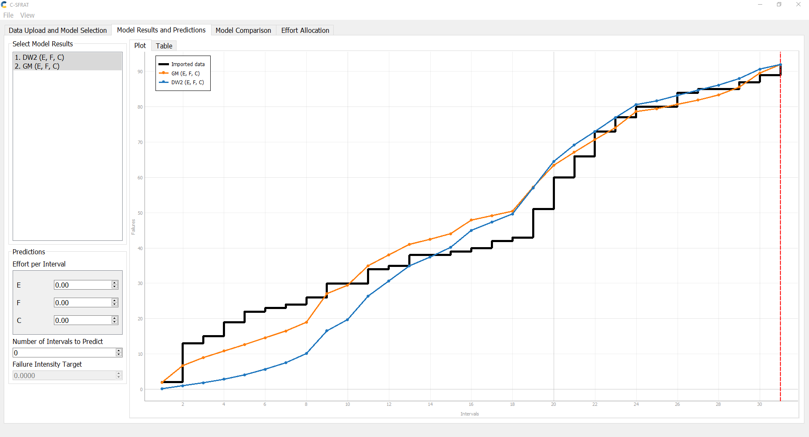
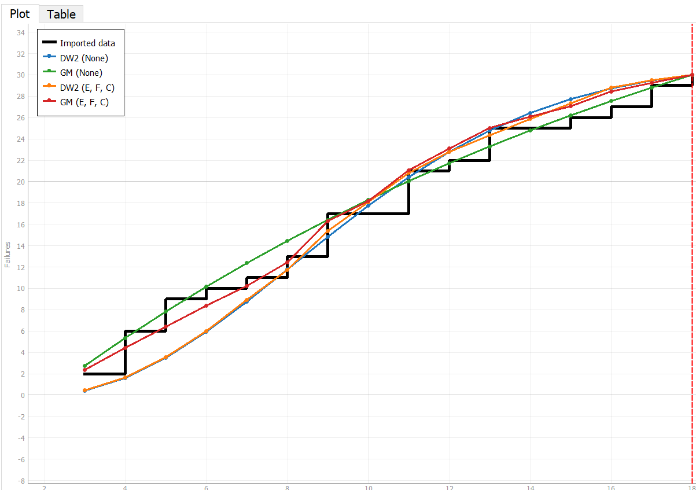
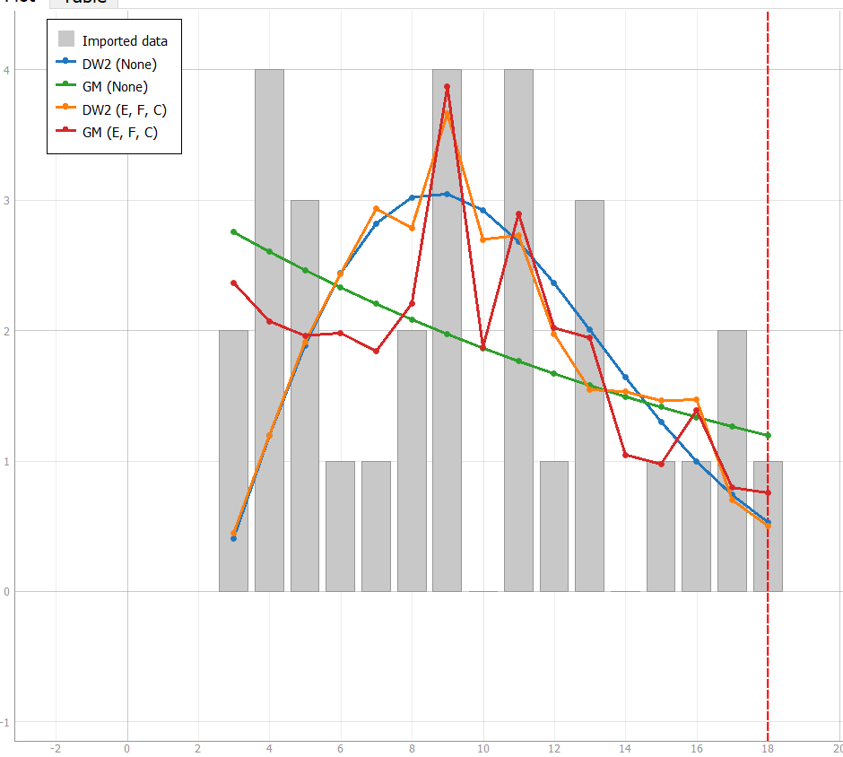
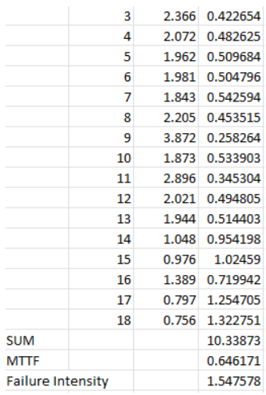
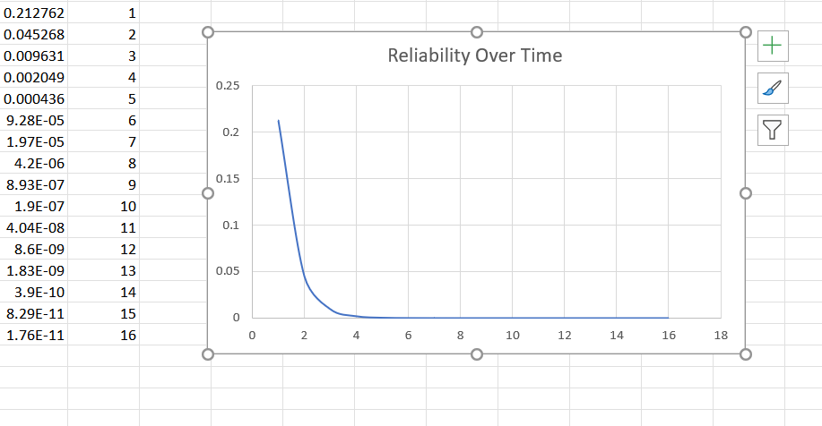
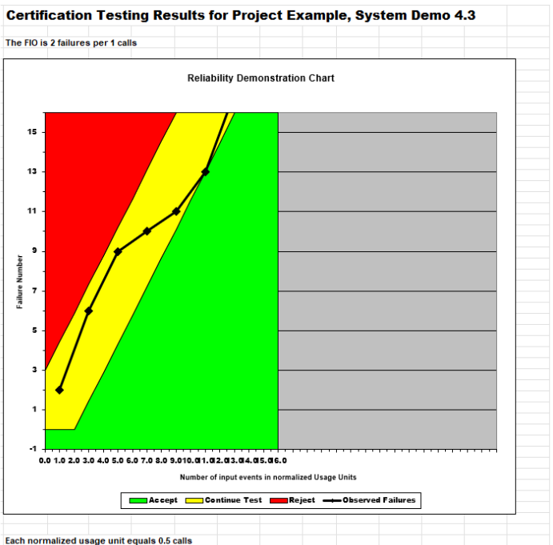
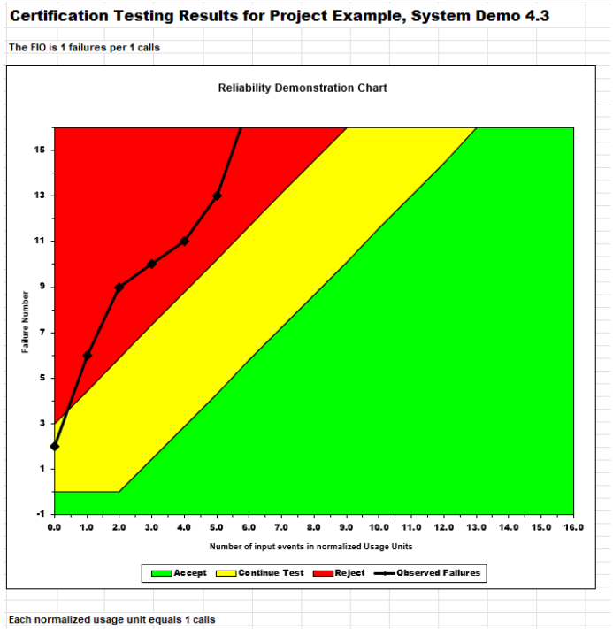
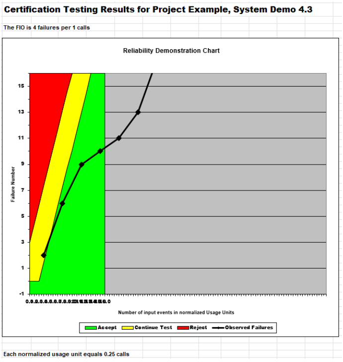

# SENG 438- Software Testing, Reliability, and Quality

## Lab. Report \#5 – Software Reliability Assessment

| Group \#:       | 32  |
|-----------------|---|
| Student Names:  |   |
|                 |  Benson Li      |
|                 |  Henrique Andras |
|                 |  Kevin Araujo  |
|                 |   Mohamed Yassin  |

## **Introduction**

In this lab, we take a deep dive into utilizing tools that help us visualize and make decisions on failure data. We utilized 2 methods which included Reliability growth testing and Reliability assessment using Reliability Demonstration Chart(RDC). Reliability growth testing involved multiple tools and models that were used to refine, visualize and predict data. RDC involved using fewer tools and models but still generating a very visual and detailed graph with which we could make decisions with.

## **Assessment Using Reliability Growth Testing**

Originally we tested all models to get a feel and perspective on how accurately models represented the data. 

Original raw data with all models:

After testing multiple models and comparing them we determined that the GM and DW2 models were the ones that fit our model the best.

After determining our models we moved to range analysis using the following LaPlace Formula:

Now using this formula in excel, we looked at the biggest range of data that was able to behave with “stable reliability” which is a Laplace score between -2 and 2. Using the excel combinations we determined that the range of t=3 to t=18 was the one that best satisfied this profile as it had a Laplace score of -1.1629.

Now graphing this new range with the selected models we get:

A great improvement can be seen in the tracking of actual data with the models.

**Failure rate graph with chosen data and models:**

**Calculation for MTTF and Failure Intensity:**

**Reliability Graph:**

Given a target failure rate, a system is either acceptable or needs to be improved. In the case of our system, its failure rate is 1.54. If the target failure rate was at 1.0, then this system would not be acceptable. This means that the system needs to be improved with things like better bug testing, longer development times to fix the bugs, and a redo of the reliability growth test. In the case where the target failure rate is for example 2.0, the system is acceptable and can be used to ship out. However, this scenario is unrealistic because, with our current failure rate of 1.54, it means that the reliability in the first time interval of use would only be 21%. A 90+% reliability would be more realistic meaning a failure rate of around 0.1 or less. 

**Advantages of Reliability growth testing Testing**

* This process provides more in-depth predictions and data for decision making
* It gives a bigger picture view of reliability and growth

**Disadvantages of Reliability growth testing Testing**

* It takes multiple steps and is time-consuming
* The process as a whole is confusing and requires more knowledge to obtain reliability
* The Laplace test will reduce the range of usable data, meaning the result gathered from the full data set will differ from the data set with a good Laplace score

## **Assessment Using Reliability Demonstration Chart**

Over the** **useful range of data calculated in our range analysis: interval 3-18 of the failure data.

**MTTFmin = 0.5**

**MTTFmin*2 = 1**

**MTTFmin/2 = 0.25**

The MTTFmin was decided based on the minimum MTTF required for one data point to pass the default test at Discrimination Ratio γ = 2.000, Developer's Risk α = 0.100, User's Risk β= 0.100. Where in the test the observed failure at the normalized time of failure at 12.0 with a failure number of 13 passes the accepted boundary in the RDC without being rejected a single time.

**Advantages of RDC Testing**

* It is fast in the case where you just need to input the failure data
* It is very easy to tell from the RDC when the failure data passes the test by looking at the colors

**Disadvantages of RDC Testing**

* The parameters for the risk profile can be arbitrary 
* It is difficult with the tools provided/recommended to see the full range of failure data 

## **Comparison of Results**

For the reliability growth testing, we reached the conclusion that since our Failure Intensity was ~1.54 with reliability of around 21% for the first time interval of use, the system needs to be tested more extensively to increase its reliability. One part of the system to note is that after around 4 hours of use, the reliability is suddenly near 0, and stays that way for the rest of the time. 

For the reliability demonstration chart results, the system only passed the default test when we adjusted the target failure intensity to be higher. For example, when MTTFmin = 0.5, which means failure intensity is 1/0.5 = 2, the certification results gave us the conclusion that the system probably needs more testing since the trendline was mostly in the yellow “continue testing” category, but passes the RDC since it reaches the green "accept" range. When the MTTFmin was adjusted to be MTTFmin/2 = 0.25 which means the target failure intensity is 1/0.25 = 4, the trendline was almost fully in the green “accept” category, which means our system is reliable enough.

## **Discussion on Similarity and Differences of the Two Techniques**

* Reliability Growth Testing technique provided a detailed analysis of data trends, RDC did not have the same level of detail. 
* Both RDC and Reliability Growth Testing have strong visual representations, although RDC is simpler and more visually spelling to read/understand.
* Reliability Growth Testing relied in treating and managing data as well as choosing the right model fit; This brought a lot of complexity and variables into  Reliability Growth Testing. RDC is more straightforward and simple in its methodology.
* RDC has a better acknowledgment of risks taken by people involved in the product in its model, while Reliability Growth Testing has more focus on the product itself.

## **How the teamwork/effort was divided and managed**

We met up and distributed the work through the members of the team. 

## **Difficulties encountered, challenges overcome, and lessons learned**

 \
We felt that the tools were difficult to use, and we had to ask the TA in person for further details regarding generating the graphs. 

## **Comments/feedback on the lab itself**

Overall, It would be better if there are specific step-by-step instructions on using the tools to generate graphs because then we can just focus on applying our knowledge rather than figuring out how to understand various tools. 

